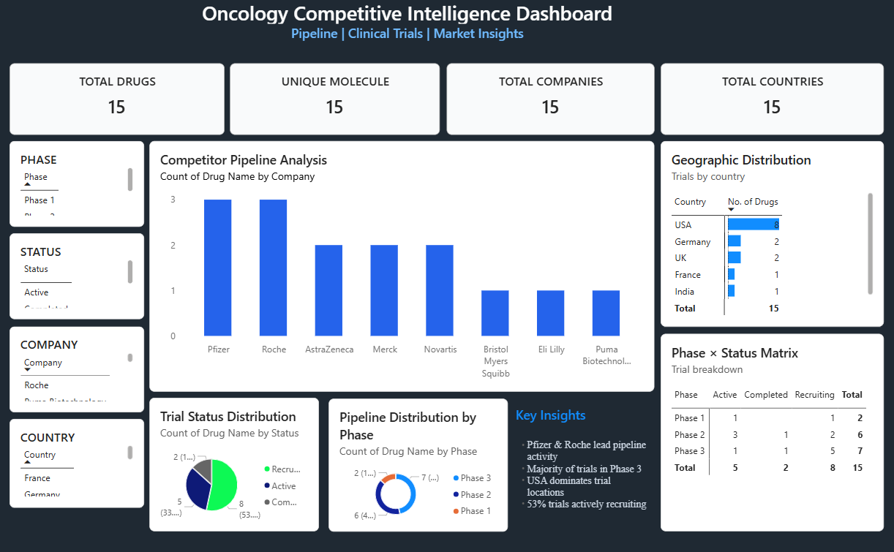

# Oncology Competitive Intelligence Dashboard

## Overview
This Power BI dashboard provides insights into oncology clinical trials, pipeline distribution, competitor analysis, and geographic trial activity.

---

## Key KPIs
- Total Drugs: 15
- Unique Molecules: 15
- Total Companies: 8
- Total Countries: 6

---

## Dashboard Features
- Competitor Pipeline Analysis
- Trial Status Distribution
- Pipeline Distribution by Phase
- Geographic Distribution of Trials
- Phase × Status Matrix
- Interactive Slicers:
  - Phase
  - Status
  - Company
  - Country

---

## Key Insights
- Pfizer & Roche lead pipeline activity
- Majority of trials are in Phase 3
- USA dominates clinical trial locations
- ~53% trials are actively recruiting

---

## Tools Used
- Power BI
- Microsoft Excel
- GitHub

---

## Files Included
| File | Description |
|------|-------------|
| Oncology_CI_Dashboard.pbix | Power BI dashboard file |
| Oncology_CI_Dashboard.pdf | Exported dashboard |
| dashboard.png | Dashboard preview image |
| data.xlsx | Dataset used for analysis |

---

## Data Source
Sample oncology clinical trial dataset created for learning and portfolio purposes.

---

## Author
Pooja Surankar
